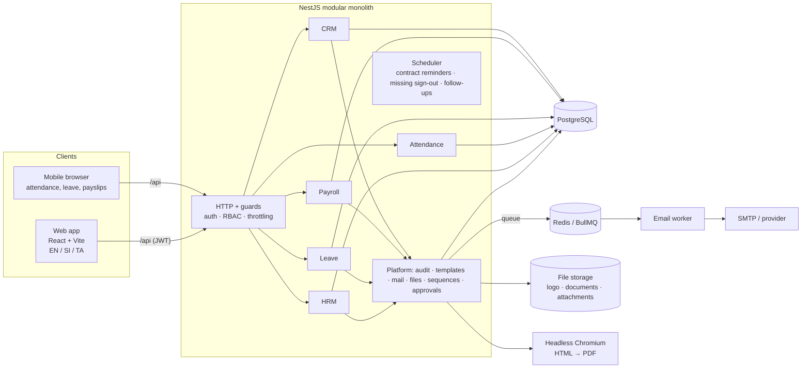
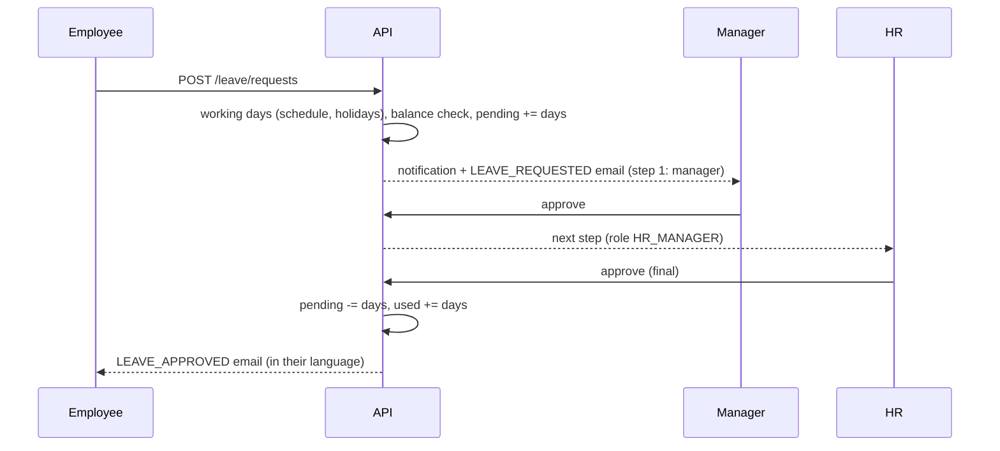
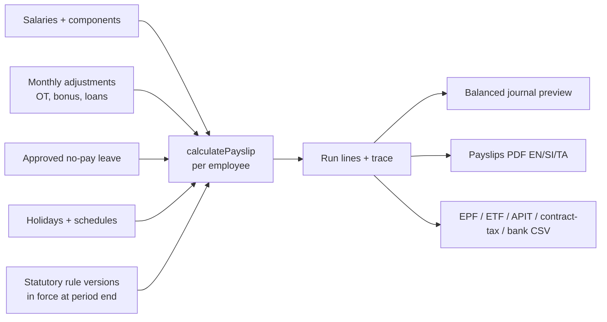

# Architecture

## System

* **Modular monolith.** Each business area is a NestJS module with its own controller and service; modules talk through services, not HTTP, so any of them can be extracted later.
* **Pure calculation core.** Payroll, attendance and leave rules live in `packages/shared` as pure functions with unit tests. The API loads data, calls the engine, and persists the result plus a calculation trace.
* **Multi-company ready.** Every business table has `company_id`; every query is scoped by the signed-in user's company.

## Request pipeline

1. `ThrottlerGuard` (300 req/min; 10/min on login).
2. `JwtAuthGuard` verifies the 15-minute access token and loads the user's effective permissions (cached 30 s per process).
3. `PermissionsGuard` enforces `@RequirePermissions(...)`.
4. The service applies the permission **scope** (own / team / department / company) to the database query (`common/scope.ts`), so a user can never read records outside their scope even if they guess an ID.
5. Every sensitive change writes an audit entry inside the same transaction.

## Key data flows

## Scaling notes

* Payroll loads all inputs in a handful of bulk queries and calculates in memory; 1,000 employees take a few seconds. Lines are written with one `createMany`.
* Emails go through an outbox table and a BullMQ queue (5 concurrent, 20/s rate limit, 5 retries with back-off). Add worker instances to scale; set `ENABLE_SCHEDULER=false` on extra web nodes so cron jobs run once (a Redis lock also prevents duplicates).
* Lists are paginated server-side; indexes cover company/status/date filters.
* Templates are compiled once and cached by source; PDF rendering reuses one browser process with a fresh, JavaScript-disabled context per document.

## Module map

| Module | Path | Responsibility |
|---|---|---|
| auth | `src/auth` | Login, lockout, refresh rotation with reuse detection, password change |
| access | `src/access` | Users, roles, permission catalogue, guards |
| audit | `src/audit` | Append-only audit log (DB trigger blocks UPDATE/DELETE) |
| org | `src/org` | Departments, teams, designations, locations, work schedules |
| hrm | `src/hrm` | Employees, contracts, documents, CSV export |
| attendance | `src/attendance` | Sign-in/out, breaks, daily board, corrections, trends |
| leave | `src/leave` | Types, entitlements, balances, requests, approvals, holidays |
| approvals | `src/approvals` | Configurable multi-step approval workflows |
| payroll | `src/payroll` | Statutory rule versions, salaries, adjustments, runs, payslips, reports |
| crm | `src/crm` | Customers, contacts, leads, pipeline, opportunities, activities, quotations |
| templates | `src/templates` | Handlebars rendering, email + document templates, PDF |
| mail | `src/mail` | Outbox, queue, providers (log, SMTP) |
| settings | `src/settings` | Company & branding, logo, sequences, tax codes, exchange rates, notifications |
| jobs | `src/jobs` | Scheduled reminders |
